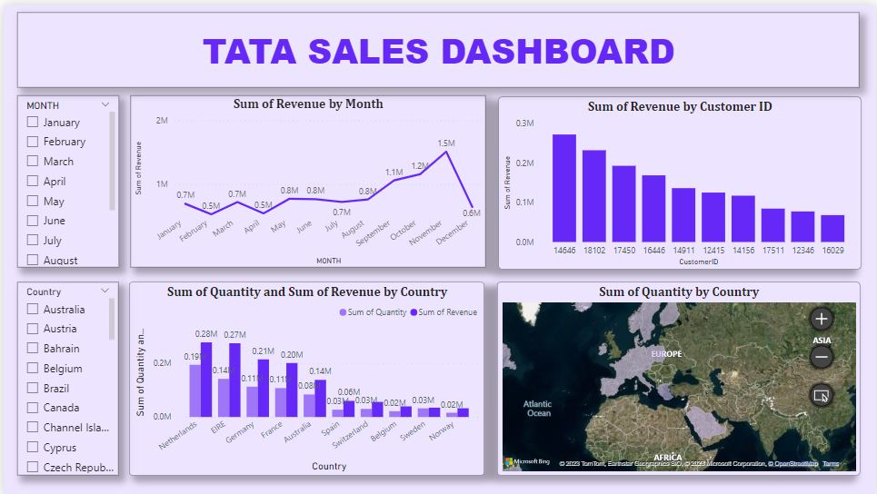

# Tata_Sales_Dashboard
This is a sales dashboard showing the revenue pattern of an organization.

This project is on the Tata Sales Dashboard, and it shows the analysis of the company's revenue, quantity sold, and also the best buying country and individual.

Analyzing the revenue of a country has a great impact on a company because a company can only be a going concern when it generates profits.

There is no profit generation if there is no revenue, and there can’t be revenue if there are no customers buying.

All these factors have been explained in this visualization.
This dashboard shows the revenue made monthly by the company and it revealed that the company had inconsistent revenue throughout the year, and notably, there was a decline in revenue in four (4) months and no substantial increase in profit in the first eight (8) months. This is a serious concern, and it needs to be addressed because a company with such a revenue pattern might be ineffective to make predictions in years to come.

In the ninth month through the eleventh month, there was good revenue generation for the company. It's advised that the company look at the cause of the consistent revenue generation and try to adapt it for other months.

This dashboard also shows the customers with the highest patronage, and it should be noted that customers with customer IDs 14646, 18102, and 17450 are the top 3 customers that patronize this company. It is advised that the company pay more attention to them because they are its key customers. The company can decide to give them a discount, attend to their complaint on time, and make use of a feedback mechanism with them because they are likely to come back to buy more and refer colleagues and friends.

Furthermore, the country with the highest generating revenue and highest order by country is the Netherlands with is the star country for the company using BCG Matrix, with a twenty-eight-million-naira profit (28,000,000) and a nineteen-million-naira quantity. It is advised that the company extend a fraction of its business to this country, which will encourage increased patronage and also make it easy for the customers in the country to have access to the goods on time, which will help improve delivery time.

In conclusion, the company should identify its peak period and make use of these periods to recoup revenue for itself against periods with little sales.

# please view and download pdf. and pbix. files for full report and interactions
